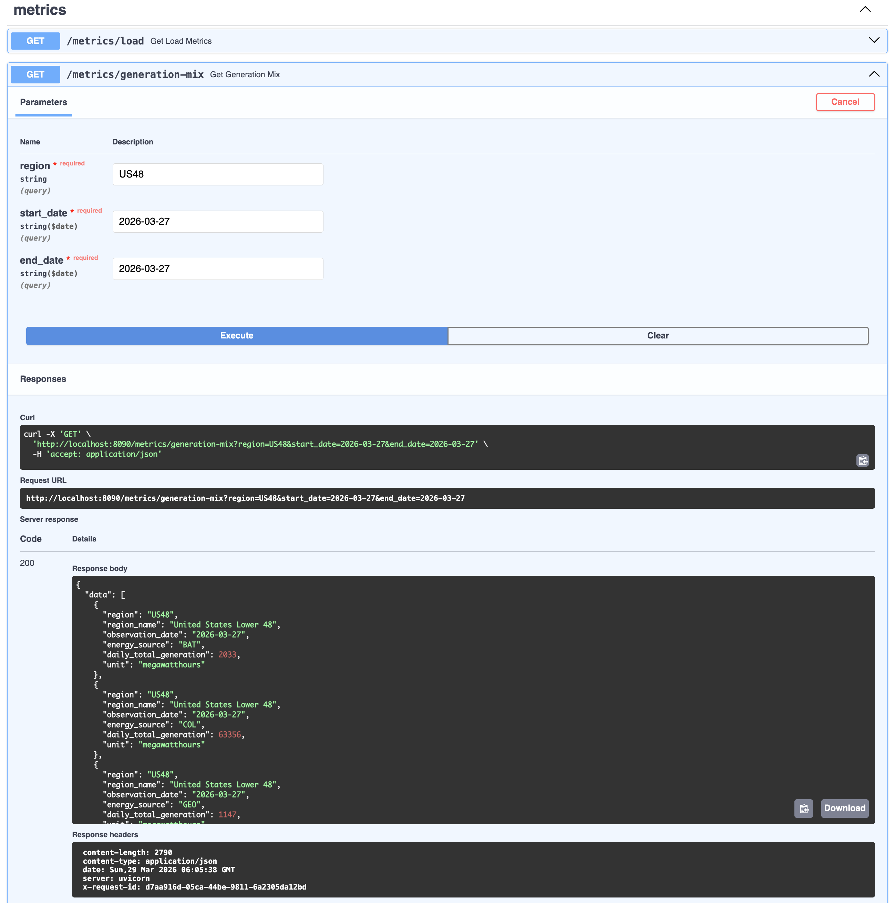

[English](./README.md) | [简体中文](./DOCS/Docs_zh/README_zh.md)

# VoltageHub

[](./pyproject.toml)
[](./LICENSE)
[](https://airflow.apache.org/)
[](https://www.getdbt.com/)
[](https://fastapi.tiangolo.com/)

An end-to-end batch analytics project built on EIA grid operations data, with Airflow orchestration, a layered BigQuery warehouse, and FastAPI plus MCP serving interfaces.

## Overview

The U.S. Energy Information Administration (EIA) publishes operational electric-grid data, including generation, demand, and interchange across balancing authorities. VoltageHub turns that data into an end-to-end batch analytics pipeline spanning ingestion, warehouse modeling, and serving.

The project turns raw EIA grid data into query-ready analytical tables and stable serving interfaces. Data lands in GCS, loads into BigQuery, moves through dbt's layered transformations, and is exposed through FastAPI and MCP. Control-plane tables track run state and freshness for end-to-end observability.

**Tech stack**: Airflow · BigQuery · dbt · FastAPI · MCP · GCS · Terraform · Docker · GitHub Actions

## Project Highlights

- Time-window ELT with support for incremental sync, reruns, and historical backfill
- Raw landing in GCS keeps batches replayable and auditable while decoupling ingestion from downstream processing
- Layered BigQuery warehouse built with dbt for standardized modeling and precomputed analytics
- Partition-scoped incremental rebuilds keep reruns idempotent and limit downstream work to affected dates
- Operational observability across pipeline state, run metrics, freshness tracking, and anomaly detection
- FastAPI serving layer backed by pre-aggregated warehouse tables rather than direct fact-table queries
- stdio MCP interface for LLM agents that shares the same business semantics as the REST API

## Demo

The screenshots below show the full path from orchestration to warehouse outputs to serving.

### 1. Airflow DAG execution flow


Shows the full orchestration flow, from extraction and GCS landing to dbt builds, anomaly checks, and pipeline state updates.

### 2. Canonical staging model in BigQuery


Raw EIA records standardized in the staging layer, providing a clean foundation for downstream marts and APIs.

### 3. Precomputed daily regional load mart


Precomputed daily regional load metrics in the mart layer, ready for downstream queries and API access.

### 4. FastAPI analytical endpoint



Shows analytical endpoints backed by precomputed warehouse outputs.

## Architecture

### System Architecture

```text
Source Layer
  -> EIA public grid data APIs

Orchestration Layer
  -> Airflow DAG scheduling
  -> time-window batch execution
  -> incremental sync and backfill

Raw Data Layer
  -> GCS raw landing
  -> replayable batch files
  -> BigQuery raw ingestion

Transformation Layer
  -> dbt staging canonicalization
  -> fact, dimension, and aggregate models
  -> partition-scoped incremental rebuilds

Control Plane Layer
  -> pipeline state
  -> run metrics
  -> freshness tracking
  -> anomaly results

Serving Layer
  -> FastAPI analytical endpoints
  -> stdio MCP tools and resources for LLM agents
  -> health, freshness, pipeline status
  -> metrics and anomaly access
```

Airflow orchestrates ingestion, GCS and BigQuery handle raw landing and storage, dbt builds the warehouse, and the serving layer exposes curated outputs from `marts` and `meta` through both FastAPI and MCP.

### Pipeline Flow

Each DAG run processes a single time window derived from Airflow's scheduling context:

```text
extract_grid_batch
-> land_raw_to_gcs
-> load_to_bq_raw
-> dbt_source_freshness
-> dbt_build
-> check_anomalies
-> record_run_metrics
-> update_pipeline_state
```

Airflow coordinates the workflow, while core transformation and analytical work happens in BigQuery through dbt models and post-build checks.

### Warehouse Layers

- `raw`: Source-shaped batch landing that preserves upstream EIA response structure for replay and auditability
- `staging`: Canonicalized and standardized grid metrics serving as a clean foundation for downstream modeling
- `marts`: Fact, dimension, and aggregate tables designed for analytical consumption and API serving
- `meta`: Control-plane tables tracking pipeline state, run metrics, freshness, and anomaly results

This layering cleanly separates ingestion, standardization, consumption, and observability responsibilities.

## Pipeline Design

### Incremental and Backfill Strategy

The pipeline runs hourly, and each DAG run processes one Airflow time window.

On each run, the pipeline extracts source data for `data_interval_start` through `data_interval_end`, idempotently reloads the matching raw partition, and rebuilds only the affected `observation_date` partitions in downstream staging and fact models. Small aggregate models are rebuilt as full tables to keep the implementation simple at the current scale.

`max_active_runs=1` is intentional: it prevents overlapping partition writes and keeps reruns deterministic. A sample mode is also available for lightweight validation using isolated datasets and a separate dbt target.

### Data Quality and Observability

Data quality is covered at three levels: dbt tests, source freshness checks, and post-build anomaly checks.

The project tracks pipeline freshness separately from data freshness, records per-run metrics in `meta` tables, and stores anomaly results as warning-only signals. Unusual patterns are recorded without blocking scheduled runs.

Control-plane outputs include:

- `meta.pipeline_state`: latest successful processing window
- `meta.run_metrics`: per-run operational metrics
- `meta.freshness_log`: pipeline and data freshness status
- `meta.anomaly_results`: anomaly summaries on key metrics

## Serving Layer

The serving layer exposes two interfaces over the same serving-safe warehouse outputs: a FastAPI REST API for application clients and a stdio MCP server for LLM agents. Both read from pre-aggregated `marts.agg_*` tables and `meta.*` tables rather than aggregating large fact tables at request time.

The REST API exposes two endpoint groups: operational endpoints (health, freshness, pipeline status) and analytical endpoints (load trends, generation mix, top-demand regions). The MCP server packages the same core capabilities as curated tools and resources, with schema and data-quality context to help agents choose capabilities safely.

Each response includes the following metadata so consumers can interpret results alongside current pipeline state:

- `data_as_of`
- `pipeline_run_id`
- `freshness_status`

## Quick Start

**Prerequisites**: GCP account with service account credentials, Docker, Terraform, Make, uv.

```bash
cp .env.example .env
make terraform-init
make terraform-apply
make build && make up
```

After that, trigger `eia_grid_batch` in Airflow to run the pipeline, then query the REST API at `http://localhost:8090`.

To start the MCP server locally, first configure `.env`, including `MCP_GCP_PROJECT_ID` and `MCP_GOOGLE_APPLICATION_CREDENTIALS`:

```bash
cd mcp
uv sync --dev
uv run voltagehub-mcp
```

For full environment setup, credentials, smoke tests, sample mode, and troubleshooting, see [SETUP.md](DOCS/SETUP.md). For product scope and the MCP interface contract, see [SPEC.md](DOCS/SPEC.md) and [MCP.md](DOCS/MCP.md).

## Project Layout

- `terraform/`: infrastructure as code for GCP resources
- `airflow/`: DAG definitions and orchestration logic
- `dbt/`: warehouse models, tests, and documentation
- `serving-fastapi/`: analytical API and query layer
- `mcp/`: stdio MCP interface for LLM agents
- `tests/`: unit and integration tests
- `DOCS/`: development specs, architecture, FastAPI and MCP interface definitions, and testing notes

## Dependencies and References

This project is built with the following tools and frameworks:

- [Apache Airflow](https://airflow.apache.org/): Workflow orchestration for batch ingestion, dbt execution, and control-plane updates.
- [BigQuery](https://cloud.google.com/bigquery): Analytical warehouse for `raw`, `staging`, `marts`, and `meta` datasets.
- [dbt Core](https://www.getdbt.com/) and [dbt-bigquery](https://docs.getdbt.com/docs/core/connect-data-platform/bigquery-setup): Warehouse transformations, tests, freshness checks, and documentation.
- [Docker](https://www.docker.com/) and [Docker Compose](https://docs.docker.com/compose/): Local development environment for Airflow and supporting services.
- [FastAPI](https://fastapi.tiangolo.com/): Serving layer for analytical and operational endpoints.
- [GitHub Actions](https://github.com/features/actions): CI/CD for linting, dbt validation, and Terraform checks.
- [Google Cloud Storage (GCS)](https://cloud.google.com/storage): Raw landing zone for replayable and auditable batch files.
- [Model Context Protocol (MCP)](https://modelcontextprotocol.io/): stdio interface for LLM agents over curated analytical tools and resources.
- [Pydantic](https://docs.pydantic.dev/): Request and response validation for the API layer.
- [Requests](https://requests.readthedocs.io/): HTTP client used by Airflow ingestion tasks to call upstream EIA APIs.
- [ruff](https://docs.astral.sh/ruff/) and [sqlfluff](https://docs.sqlfluff.com/): Python and SQL linting.
- [Terraform](https://www.terraform.io/): Infrastructure as code for GCP resources and IAM configuration.
- [Uvicorn](https://www.uvicorn.org/): ASGI server used to run the FastAPI service locally and in development workflows.
- [uv](https://docs.astral.sh/uv/): Python dependency management and local command execution.

## License

This project is licensed under the Apache License 2.0 — see the `LICENSE` file for details.
